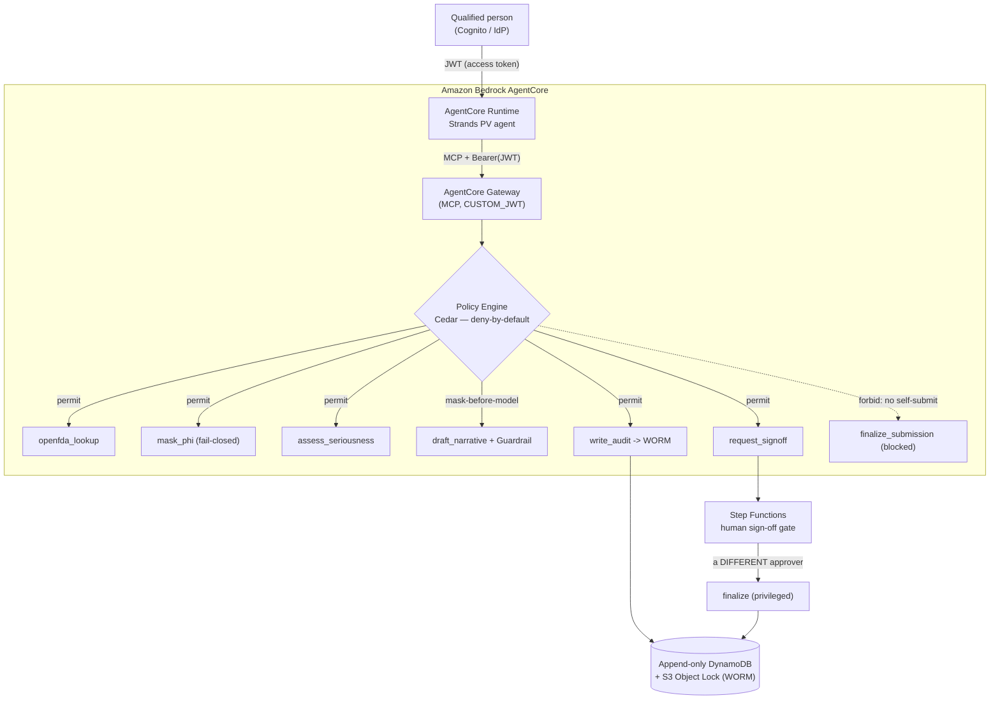

# Pharmacovigilance Agent — Governed Agentic AI on Amazon Bedrock AgentCore

A **governed** pharmacovigilance (drug-safety) intake agent that assembles, codes, and drafts an
Individual Case Safety Report (ICSR) — and **never self-submits**. It runs natively on Amazon
Bedrock AgentCore with deny-by-default authorization (Cedar), fail-closed PHI masking, an immutable
audit trail, and a human sign-off gate. Every governed action is authorized against the identity of
the human the agent is acting for, and proven live by a governance test that runs in enforcement mode.

> **Accelerator, not a certification.** This is a reference implementation of the *pattern*. It is not
> a production-certified system. Computer-system validation (CSV/CSA), IdP federation, connectors to
> live safety systems, licensed MedDRA/WHODrug dictionaries, and production authorization to operate
> remain the adopter's responsibility. See [`docs/`](docs/) and the honesty boundary below.

---

## Why this agent exists

Pharmacovigilance is drug-safety surveillance. When an adverse event is reported, a regulated intake
workflow must run end to end: parse the source, extract the E2B(R3) fields, code the event (MedDRA)
and drug (WHODrug), assess seriousness and the reporting clock (expedited vs. periodic), draft a
CIOMS/ICSR narrative, obtain a qualified person's review and sign-off, and submit the ICSR to the
regulator (FDA/EMA).

### The pain point

This intake work is high-volume, time-critical, and expensive — safety teams triage and draft
thousands of cases against hard regulatory clocks. It is the obvious place to apply an AI agent. But
regulated safety organizations **cannot adopt an ungoverned agent**, because the workflow sits under
GVP, ICH E2B(R3), FDA 21 CFR Part 11, and HIPAA. A naive LLM agent fails four ways at once:

- it can expose **PHI** to the model or to logs;
- it produces **no tamper-evident audit trail** of what it did and why;
- it has **no authorization boundary** — nothing stops it from calling a tool it shouldn't;
- it can **act without a qualified human**, and under GVP/Part 11 a qualified person must make the
  causality/reportability determination and commit the submission.

### How we solve it

We keep the human in charge and make the platform enforce it. The agent assembles, codes, and drafts
under governance, and **pauses at a human sign-off gate before any submission**. That single rule —
*a qualified person decides and commits; the agent never self-submits* — drives the whole security
design, implemented with primitives that are now **native to Amazon Bedrock AgentCore**, plus three
last-mile controls a regulated customer needs that AgentCore doesn't provide out of the box.

| Control (governed-agent requirement) | Native on AgentCore? | How |
|---|---|---|
| Verified human + agent identity | ✅ Native | **AgentCore Identity** — inbound JWT authorizer (Cognito / customer IdP) |
| Deny-by-default tool authorization | ✅ Native | **AgentCore Policy (Cedar)** — default-deny + forbid-wins, enforced at the Gateway |
| Least-privilege (agent ∩ human) | ✅ Native | Cedar principal = `AgentCore::OAuthUser`; JWT claims (group/role) as tags + tool-parameter conditions |
| Tools as governed endpoints | ✅ Native | **AgentCore Gateway** — Lambdas → MCP tools; every call passes Policy |
| Agent hosting / runtime | ✅ Native | **AgentCore Runtime** — hosts the Strands agent, serverless, session-isolated |
| Tracing / observability | ✅ Native | **AgentCore Observability** — OpenTelemetry spans per agent/tool step |
| Fail-closed PHI/PII masking | 🔧 Build | `mask_phi`: Comprehend Medical `DetectPHI` + Comprehend PII backstop, before model **and** before audit |
| Seriousness + reporting clock | 🔧 Build | `assess_seriousness`: ICH E2B(R3) / 21 CFR 314.80 rules engine (no licensed data) |
| Human sign-off gate (separation of duties) | 🔧 Build | Step Functions `waitForTaskToken` — bound, single-use approval by a *different* qualified person |
| Immutable WORM audit (Part 11 evidence) | 🔧 Build | Append-only DynamoDB + S3 Object Lock — `INTENT → COMMITTED`, tamper-evident |

---

## Architecture



**One governed action, end to end:** the human authenticates and the agent uses their access token as
the bearer for every Gateway (MCP) tool call, so Cedar evaluates the *real human principal*. Cedar
allows/denies each specific tool (default-deny; a denial is auditable and names the firing policy).
`draft_narrative` is forbidden unless the input is de-identified, so the model only ever sees masked
text. The agent cannot call `finalize_submission` (a Cedar forbid hides it); submission runs only
through the Step Functions gate, where a **different** qualified person approves with a single-use
token. Every decision and state change is written to the WORM audit; every step is traced in
Observability. The gateway URL is published to SSM so the Runtime discovers it dynamically and
survives spine redeploys untouched, while identity is a stable, long-lived Cognito pool.

Full design: [`docs/PV-AgentCore-Architecture.md`](docs/PV-AgentCore-Architecture.md).

---

## Tests — the governance is proven live, in ENFORCE mode

The controls aren't asserted in a README; they're demonstrated against the deployed system with the
policy engine in **ENFORCE**. Two harnesses:

### `scripts/demo.sh` — 20-check governance demo

Mints reviewer and outsider tokens and exercises the full governed workflow live. Expect
`20 passed, 0 failed` / `GOVERNANCE DEMO: PASS`. It proves:

- **Deny-by-default** — reviewer `ALLOW`, outsider `DENY` (`No policy applies … denied by default`).
- **Fail-closed masking** — `mask_phi` redacts name/DOB/MRN via Comprehend Medical; no unmasked text escapes.
- **Mask-before-model forbid** — drafting on un-masked input is denied, naming `mask_before_draft`.
- **Real Bedrock draft through the output guardrail** — `guardrail_applied: true`.
- **Mask-before-assess forbid** — seriousness on un-masked input is denied, naming `mask_before_assess`;
  the masked call returns `serious=true, EXPEDITED, clock_days=15`.
- **Immutable WORM audit** — write-once to the append-only ledger + Object-Lock bucket; an identical
  re-write is rejected.
- **No self-submit forbid** — `finalize_submission` is denied to the agent, naming `no_self_submit`.
- **Human sign-off gate** — a request starts the workflow; the requester cannot self-approve
  (separation of duties); a different qualified person approves; the submission finalizes only after
  approval; the approval token is single-use.

### `scripts/test_signoff.sh` — 8-check sign-off gate test

Focused end-to-end test of the Step Functions separation-of-duties gate (request → register token →
reject self-approval → approve by a different person → finalize → reject token replay).

```bash
bash scripts/demo.sh          # 20/20 governance proof (requires a deployed spine in ENFORCE)
bash scripts/test_signoff.sh  # 8/8 human sign-off gate
```

---

## Deployment runbook (quick start)

The full step-by-step runbook (with Windows/Git-Bash operational notes) is
[`docs/PV-AgentCore-SA-Runbook.docx`](docs/PV-AgentCore-SA-Runbook.docx). Condensed:

**Prerequisites:** AWS account with admin CLI (`aws sts get-caller-identity` succeeds), region
`us-east-1`, Anthropic Claude model access enabled in Bedrock, `aws` CLI v2, Python 3.12, Node 18+
(for the doc generators only), and Bash (Git-Bash on Windows). Three independent lifecycles: a stable
**identity** stack, a reproducible **governance spine**, and the **Runtime** agent.

```bash
# 1. Stable identity (Cognito pool, app client, test users) — idempotent
bash scripts/deploy_identity.sh

# 2. Governance spine — IAM → WORM stores → guardrail → tool Lambdas → engine →
#    gateway(LOG_ONLY) → targets → Cedar policies → flip ENFORCE → human gate → publish SSM
bash scripts/deploy_spine.sh

# 3. Prove the governance (17→20 checks, ENFORCE)
bash scripts/demo.sh

# 4. Runtime agent (from runtime/): venv + configure JWT authorizer + launch (CodeBuild ARM64)
cd runtime
bash setup_venv.sh
bash _obs_setup.sh
bash _configure.sh
bash _launch.sh

# 5. Invoke as a reviewer (full workflow) and an outsider (access denied)
bash _invoke.sh reviewer 'PvReviewer#2026!'
bash _invoke.sh outsider 'PvOutsider#2026!'

# Teardown — zero residual (identity preserved by design)
bash scripts/destroy_spine.sh
```

Reviewer invoke returns a workflow summary (FAERS lookup, masked narrative, seriousness/clock, INTENT
audit, `PENDING_APPROVAL`) and `tools_available` that **excludes** `finalize_submission` — Cedar hides
the forbidden tool. Outsider returns `ACCESS DENIED` with `tools_available: []`.

> The default test-user passwords above are for a **private evaluation account only**. Rotate them (or
> federate a real IdP) before the environment is shared.

---

## Repository layout

```
scripts/     Infrastructure-as-code + tests (bash + aws-cli)
             deploy_identity · deploy_spine · demo (20-check) · test_signoff (8-check)
             · destroy_spine · destroy_identity · pv-signoff.asl.json (Step Functions)
tools/       Gateway tool Lambda bodies + mcp_client.py
             mask_phi · openfda_lookup · assess_seriousness · core_tools (draft/finalize)
             · write_audit · request/approve/finalize sign-off
policies/    Cedar policy source (permit + mask_before_draft / mask_before_assess / no_self_submit)
runtime/     The Strands agent on AgentCore Runtime (agent.py, Dockerfile, toolkit helper scripts)
docs/        Architecture (.md) + Leadership & Customer decks (.pptx) + SA Runbook,
             Regulatory-Adherence, and Maintenance guides (.docx) + doc generators
```

## Regulatory anchors

- **GVP / ICH E2B(R3)** — ICSR structure, reporting clocks, the qualified-person determination → the
  tools + `assess_seriousness` + the human gate.
- **21 CFR Part 11** — electronic records & signatures → the immutable WORM audit + bound single-use
  approval + verified identity.
- **HIPAA** — PHI → fail-closed masking + least-privilege Cedar + records kept in-account.

Full control-to-requirement mapping: [`docs/PV-AgentCore-Regulatory-Adherence.docx`](docs/PV-AgentCore-Regulatory-Adherence.docx).

## Honesty boundary

The accelerator owns the governed agent, the Cedar policies, the tools, the masking, the human-gate
workflow, the audit design, the IaC, and the docs. The **adopter** owns: IdP federation and workforce
role mapping, connector validation to live safety systems (Argus/Veeva) under a BAA, licensed MedDRA /
WHODrug dictionaries and validated coding (`code_meddra_whodrug` ships as a **labeled stub** for
exactly this reason), computer-system validation for the intended use, and production ATO. Nothing
here is production-certified on day one — and saying so is part of the credibility.
